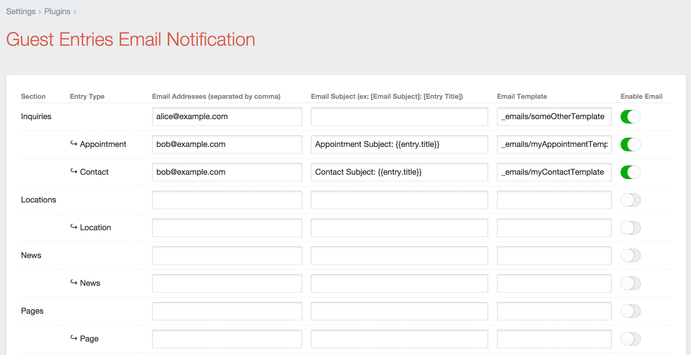

# Guest Entries Email Notification
### A Craft CMS Plugin

This plugin extends Pixel &amp; Tonic&rsquo;s [Guest Entries](https://github.com/pixelandtonic/GuestEntries/) plugin with email notifications.

## About

From the [original release notes](https://github.com/wbrowar/Craft-Guest-Entries-Email-Notification/blob/master/README.md):

> Here&rsquo;s the scenario. I&rsquo;m a big fan of saving a copy of form submissions into the database as a backup for clients. While the [Contact Form](https://github.com/pixelandtonic/ContactForm/) plugin is great for a very basic contact form, I often find myself needing other form fields that have their own validation needs. The [Guest Entries](https://github.com/pixelandtonic/GuestEntries/) plugin works great for creating the backup entries, but it just lacks the notification to the client that a new submission has been added.

The plugin takes the field values submitted through a Guest Entries-based form and emails it to a list of people of your choosing.

## About this fork

Both the email subject and the body can be composed as **Twig templates**. The default template renders the raw field data as a table, handling arrays on the first level but nothing else.

The plugin supports differentiating between entry types as well, not just between sections.

## Installation

1. **This plugin requires the [Guest Entries](https://github.com/pixelandtonic/GuestEntries/) plugin**, so install this upfront
2. Upload the `guestentriesemail/` folder to your `craft/plugins/` folder.
3. Enable the plugin in the CP.
4. Configure settings to setup emails based on content types.

## Releases

##### 0.1.2

* Added Twig support
* Added support for different entry types

##### 0.1.1

* Forked the original repo
* Some basic clean up

##### 0.1.0

* Send basic emails from text and textarea form fields
