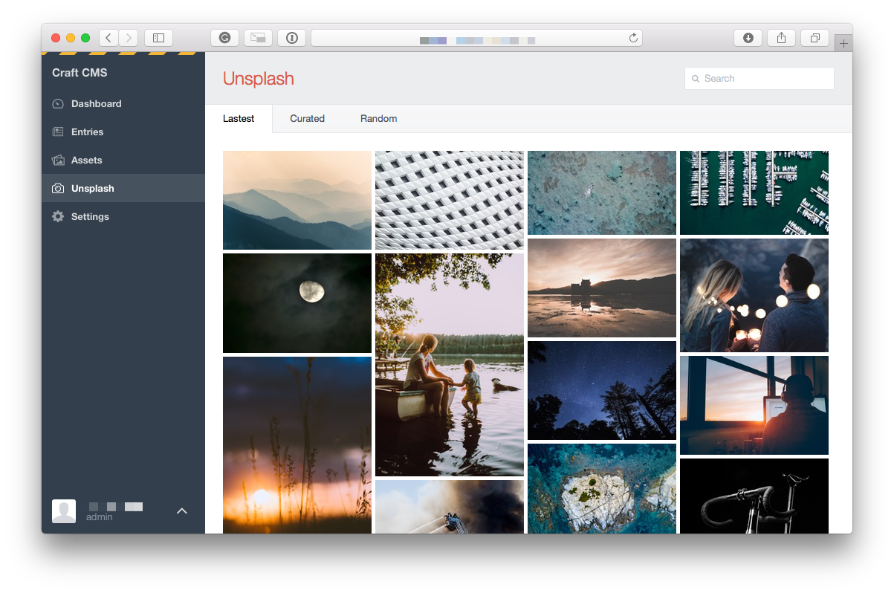

# Splashing Images for Craft CMS

Unsplash integration for CraftCMS

## Installation

To install Splashing Images, follow these steps:

1. Download & unzip the file and place the `unsplash` directory into your `craft/plugins` directory
2. Install plugin in the Craft Control Panel under Settings > Plugins
3. The plugin folder should be named `unsplash` for Craft to see it.  GitHub recently started appending `-master` (the branch name) to the name of the folder for zip file downloads.

Unsplash works on Craft 2.4.x and Craft 2.5.x.

## Overview

Unsplash.com offers stunning photos, free for you to use wherever you want. The Unsplash license allows for photographs to be used for any purpose — both commercial and personal. Blogs, art, book covers, tshirts, and more — paid or unpaid — they’re all allowed under the license.

Splashing Images for Craft brings these amazing photos to your fingertips, right where you edit your content, in your dashboard. See the latest featured images or search Unsplash to find that perfect image you need for your newest post.

Note: this plugin is not affiliated with unsplash.com.

## Configuration

Before you can use Splashing Images for Craft, you have to configure at least 1 Assets source, so the plugin has a place to save your images to.

##  Roadmap

* Craft 3 compatibility
* OAuth option so the user gets access to their own images and to the collections they have on Unsplash.
* See if we can hook onto the AssetField modal (search for an image and add it as an asset + insert it into the entry at the same time)

Brought to you by [Studio Espresso](https://studioespresso.co)
